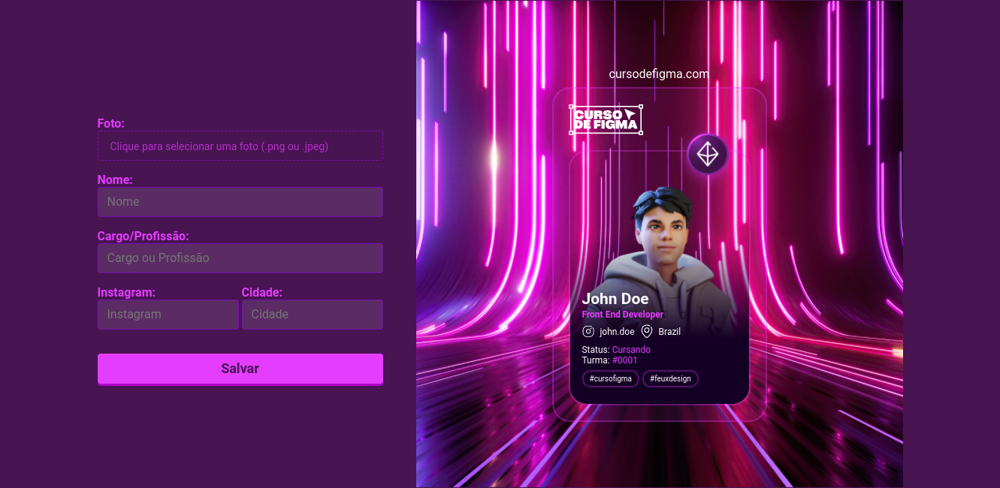

<div align="center">
  
  <p>Gerador de Tags do Curso de Figma do Felipe Santana</p>
</div>

<div align="center">
  
  
  
</div>

## Run in development

- Installing dependencies
```bash
yarn
```

- Change file name `.env.sample` to `.env` and add the following content to the file:
```
IS_DEV=true
DATABASE_URL="file:./dev.db"
```

Run project
```bash
yarn dev
```